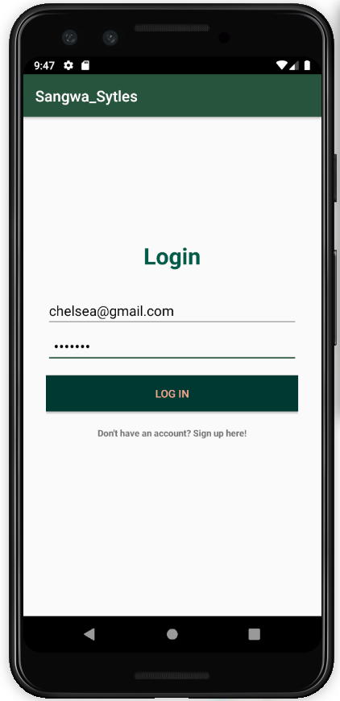

# Sangwa_Sytles

## *By Sangwa Sabine Chelsea*

## Description

Sangwa Sytles is an e-commerce phone application written in the java using Android Studio.

In this applications users can buy clothe both woman and amn, ranging from summer clothes to winter clothes.

## BDD

**The program should allow the user input**

    Input Example: "Cloth type: jean"

                   
**The program should return when the user checkout the store**

    Output Example: "Blazers
                    Price: 15$"

## Technologies Used

* JAVA
* Gradle
* Android Studio

## Installation guide   
**{follow the below instructions for set up.}**
    
   1. You will need Internet connection.
   
   2. You need to  Install Android Studio.
   
   3. You need to  Install Emulator for testing.

   4. You need to get into the Rest_api Repository.
    
     Link:-> https://github.com/Sangwa-C/Sangwa_Sytles/tree/version_3.3
        
   4. From there you can access the Sangwa_Sytles project.
    
   5. Clone the project.
    
   6. get into project folder (cd into project).

   7. If you have all the Pre-requisites you can run the application.
    
    Run the Emulator or run it the phone
    
    
**Keep in mind u can just access it on the telephone by downloading it using the app-debug.apk in the build**

## Known Bugs

<g-emoji class="q-emoji"  alias="bug" >
    
 </g-emoji>This webpage may not suitable for all screen sizes.

<g-emoji class="q-emoji"  alias="bug" >
    
 </g-emoji>   Can submit empty or invalid input.

 

<g-emoji class="q-emoji"  alias="bug" >
    
 </g-emoji> User can not delete entry.

<g-emoji class="q-emoji"  alias="bug" >
    
 </g-emoji> User can not update entry.

## Screenshots From the project

  
   
   

 
   
   
   

  
  
  

 
## Support and contact details
If you any issues or have questions, ideas or concerns contact us on chelseasabinesangwa@gmail.com.

### License

 MIT License
 Copyright (c) 2019 By Sangwa Sabine Chelsea.
 Permission is hereby granted, free of charge, to any person obtaining a copy of this software and associated documentation files (the "Software"), to deal in the Software without restriction, including without limitation the rights to use, copy, modify, merge, publish, distribute, sublicense, and/or sell copies of the Software, and to permit persons to whom the Software is furnished to do so, subject to the following conditions:
 The above copyright notice and this permission notice shall be included in all copies or substantial portions of the Software.
   
 THE SOFTWARE IS PROVIDED "AS IS", WITHOUT WARRANTY OF ANY KIND, EXPRESS OR IMPLIED, INCLUDING BUT NOT LIMITED TO THE WARRANTIES OF MERCHANTABILITY, FITNESS FOR A PARTICULAR PURPOSE AND NONINFRINGEMENT. IN NO EVENT SHALL THE AUTHORS OR COPYRIGHT HOLDERS BE LIABLE FOR ANY CLAIM, DAMAGES OR OTHER LIABILITY, WHETHER IN AN ACTION OF CONTRACT, TORT OR OTHERWISE, ARISING FROM, OUT OF OR IN CONNECTION WITH THE SOFTWARE OR THE USE OR OTHER DEALINGS IN THE SOFTWARE.
 
  MIT Copyright (c) 2019 Sangwa Sabine Chelsea. # Sangwa_Styles
  